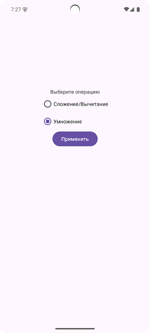
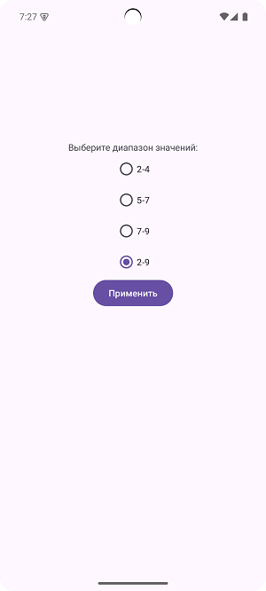
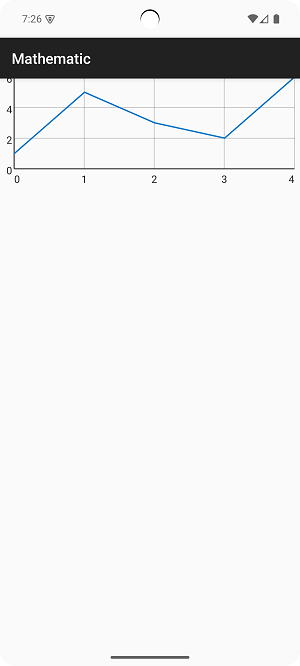

# ReadMeForOtusProject
Проект для детей Mathematics. 
Приложение выдает рандомные примеры в выбранном пользователем диапазоне. Операции также выбираются: сложение/вычитание или умножение. Пользователь решает пример и записывает ответ, в зависимости от правильности ответа приложение выдает результат и статистику, а также отправляет результат на сервер. В приложении будет реализована возможность посмотреть статистику и не правильные ответы с сервера.
Экраны-Фрагменты: выбор операции, выбор диапазона, основной экран, экран статистики. 
MVVM 
RecyclerView 
Kotlin Coroutines 
Retrofit 
Kotlin Serialization 

